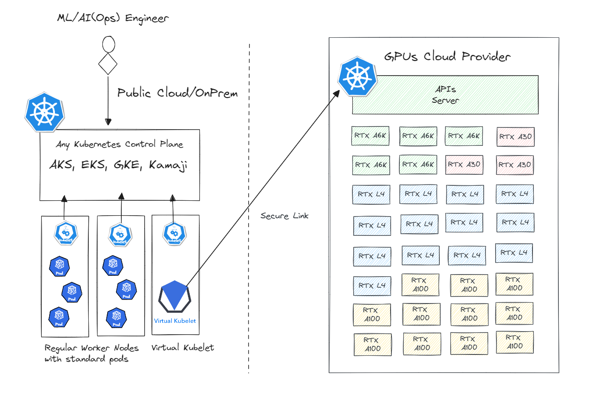

# K8sGPU Overview
K8sGPU is a cloud-native solution to consume remote GPUs in a serverless mode. It is build with [Virtual Kubelet](https://virtual-kubelet.io/) to easly link, access, and consume remote GPUs in your Kubernetes cluster.

## Use Cases
The solution is ideal for scalable GPU-powered applications, such as ML/IA training, fine tuning, and inference, and other GPU-dependent tasks, while providing a cost-effective and efficient way to connect GPUs additional computational capacity provided by 3dy party remote GPU Cloud Providers.

K8sGPU is ideal for ML/AI teams already using Kubernetes infrastructures who need to increase computing power without migrating pipelines or starting over.  

## How it works

The typical user process begins with ML/IA platform teams installing the k8sGPU agent on their existing Kubernetes Cluster deployed on-prem or any cloud provider. Once deployed, it looks like a real worker node. However, when scheduling a pod on such virtual node, the workload is created on a remote GPU Cloud instead of running in the local cluster. This architecture leverages the scalability and flexibility of Kubernetes and related ecosystem, while integrating seamlessly with remote providers' distributed GPU resources.

## Documentation

* [Quick Start](guides/quickstart.md)
* [Operations](guides/operations.md)
* [Usage from Public Cloud](guides/public-cloud.md)

## FAQ

    [Q] Is the K8sGPU agent free?
    [A] Yes, the agent is free of charge. You just pay for the GPU usage.

    [Q] How do I install the k8sGPU agent?
    [A] Install the k8sGPU agent on your Kubernetes cluster using Helm.

    [Q] Which Kubernetes distributions are supported?
    [A] K8sGPU agent runs on most of public Managed Kubernetes, as well as on-premise environments like Kubernetes vanilla and common distributions such as OpenShift, Tanzu, and Rancher. Local environments like k3s and kind are supported;

    [Q] How do I schedule my pods on the virtual node?
    [A] Schedule your pods on the virtual node by setting specific RuntimeClasses. In some cases, affinity rules and tolerations for virtual nodes are required, depending on your Kubernetes environment.

    [Q] Which container images can I run in the pods?
    [A] You can run any container image that is available from any accessible container registry. If you're new to containers, we recommend learning about container technology first.

    [Q] Can I run multiple pods on the same GPU?
    [A] Yes, you can run multiple pods simultaneously on the same GPU, but be aware that GPU memory and processing time are shared among all your workloads.

    [A] How do I select the GPU type for my workloads?
    [Q] K8sGPU supports multiple GPU types. To request a specific GPU, such as the Nvidia A100, refer to the corresponding Kubernetes RuntimeClass resource.

    [A] Are the GPUs assigned to my pods shared with other users?
    [Q] No, each GPU is exclusively assigned to a user and not shared.

    [A] Is Multi-Instance GPU (MIG) supported?
    [Q] MIG support is currently in development and will be available soon.

    [A] Are my pods protected from other users?
    [Q] Yes, your pods are isolated in a multi-tenant environment with strict network policies and are only exposed to the Internet as required.

    [A] How can I access my pod's APIs?
    [Q] Pods on the virtual node run on a remote infrastructure and are not directly accessible within your local cluster. If your pod exposes an API, you can publish it on the Internet. Note that you are the only responsible for securing access to your API.

    [A] What if I need private access to my pod's API?
    [Q] Currently, pod APIs are only exposed to the public Internet as needed. We plan to offer private access via VPN in future updates.

    [A] What if my local Kubernetes loses connectivity to the GPU?
    [Q] Your workloads will continue to run remotely. Once connectivity is restored, your pods will synchronize with their local counterparts.

    [A] Where do pods using remote GPUs store their data?
    [Q] Pods can store and retrieve data from any accessible S3 bucket globally. Support of persistent storage will be released soon.

    [A] How do I monitor GPU usage?
    [Q] Later, we will introduce a dashboard for real-time monitoring and access to historical data.